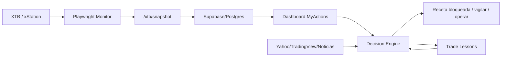

# Trading Bot Decision Engine - Especificacion Operativa

## 1. Resumen ejecutivo

El bot debe funcionar como asistente de decision, no como caja negra. La automatizacion actual ya lee XTB con Playwright, publica precio/capital/posiciones y alimenta el dashboard. La siguiente capa recomendada es un `Decision Engine` que:

- Calcula volumen por rangos de capital.
- Ejecuta o simula primero una entrada de prueba de 0.01.
- Aprende del resultado cerrado.
- Solo desbloquea receta si lectura XTB, mapa 4H, confirmacion 15M, gatillo 1M, no perseguir y margen estan alineados.
- Mantiene US100 como activo principal, pero puede vigilar alternativas si el radar detecta mejor oportunidad.

## 2. TradingView + Playwright

TradingView es util como referencia visual y para alertas, pero no debe ser la fuente final de ejecucion si operas en XTB. Cada broker CFD puede tener precio, spread, horarios y simbolos distintos. Para operar en XTB, el precio final debe venir de XTB.

Uso recomendado:

- TradingView/Yahoo/noticias: contexto, direccion macro, posibles eventos.
- XTB: precio real, spread, margen, capital, historial y confirmacion final.
- Playwright: lectura de XTB y dashboard. No debe pulsar compra/venta final sin permiso explicito.

Sobre el video de TikTok:

- Playwright pudo abrir la pagina y leer titulo/metadatos.
- No se pudo extraer una transcripcion tecnica completa desde la pagina.
- La metodologia solo debe integrarse si la convertimos a reglas medibles: POC, FVG, Fibonacci, ruptura, retroceso, rechazo y confirmacion.

## 3. Sizing por rangos de capital

Regla base: la meta no debe crecer linealmente con emocion; debe crecer por tramos.

```js
function targetRangeByCapital(capital) {
  if (capital < 1500) {
    return { standard: 30, highProbability: 50, testVolume: 0.01 };
  }
  if (capital < 3000) {
    return { standard: 40, highProbability: 60, testVolume: 0.01 };
  }
  if (capital < 5000) {
    return { standard: 50, highProbability: 70, testVolume: 0.01 };
  }
  return {
    standard: Math.min(100, capital * 0.015),
    highProbability: Math.min(150, capital * 0.02),
    testVolume: 0.01
  };
}
```

## 4. Entrada de prueba y reajuste

La entrada de 0.01 no busca dinero; busca medir si el setup responde.

```js
function adjustAfterProbe(probe, plan) {
  if (!probe.closed) return { action: "WAIT", reason: "La prueba aun no cerro." };

  if (probe.resultUsd < 0) {
    return {
      action: "REDUCE_OR_WAIT",
      nextVolume: Math.max(0.01, plan.volume * 0.5),
      reason: "La prueba fallo. No escalar todavia."
    };
  }

  if (probe.resultUsd > 0 && probe.movedTowardTarget && probe.spreadOk) {
    return {
      action: "ALLOW_MAIN_ENTRY",
      nextVolume: plan.volume,
      reason: "La prueba confirmo direccion y ejecucion."
    };
  }

  return {
    action: "WAIT",
    nextVolume: 0,
    reason: "Resultado mixto. Esperar nuevo gatillo."
  };
}
```

## 5. Arquitectura sugerida



## 6. Flujo de decision

1. Leer capital y precio real desde XTB.
2. Determinar sesion: Asia, London, NY o cerrado.
3. Construir mapa 4H para direccion grande.
4. Confirmar retroceso/rechazo en 15M.
5. Esperar gatillo 1M.
6. Si hay permiso y semaforo verde, preparar receta.
7. Entrada de prueba 0.01.
8. Leer cierre de prueba.
9. Si confirma, escalar volumen; si falla, bloquear.
10. Guardar resultado y contexto para aprendizaje.

## 7. Campos minimos para guardar

- timestamp
- session
- symbol
- capital
- available_capital
- price
- bid
- ask
- spread
- direction
- confidence
- volume
- entry
- stop
- take_profit
- setup_4h
- setup_15m
- trigger_1m
- probe_result
- final_result
- notes

## 8. Regla de seguridad

El margen dice si la operacion cabe. El stop dice cuanto puedes perder. Si el bot no puede calcular ambos con datos frescos de XTB, la receta debe quedar bloqueada.
